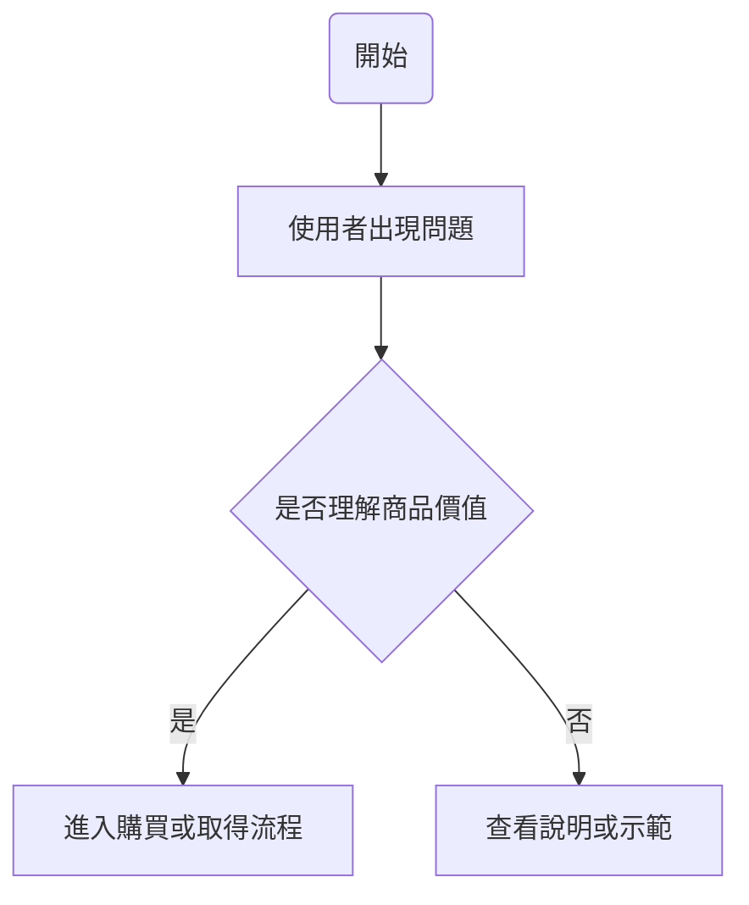

# 一般商品原型設計全流程 Skill｜從痛點研究到高保真原型規範

## 描述

此 Skill 用於將目標受眾、生活痛點或初步商品概念，轉化為完整的「一般商品原型設計流程」。

它可支援實體商品的痛點研究、Persona 建立、商品 User Flow、功能架構、Prototype Sketch、Product Design System 與高保真原型方向規劃。

適合用於商品設計課程、產品發想工作坊、設計專題、MVP 驗證、打樣前討論與商品化前期研究。

此 Skill 的核心價值是讓使用者不必每次重新撰寫提示詞，而能用固定流程產出可設計、可打樣、可測試、可交付的商品原型規格。

---

## 使用時機

適合在以下情境使用：

- 使用者想從某個目標族群找出可商品化的實體商品痛點。
- 使用者想分析某個商品概念是否適合做 MVP。
- 使用者想建立一般商品原型設計的完整課程流程。
- 使用者想把一段產品設計對話整理成可重複使用的 Skill。
- 使用者想將提示詞迭代過程變成固定模板。
- 使用者想建立可直接複製使用的 `SKILL.md`。
- 使用者想產出 Persona Card、User Flow、Mermaid 流程圖、商品功能架構、Prototype Sketch 指引或 Product Design System。
- 使用者想把抽象商品概念轉成可手繪、可打樣、可測試、可提案的開發文件。
- 使用者想避免每次重新撰寫商品原型設計提示詞。

不適合用於：

- 純軟體 UI 設計任務，除非任務涉及實體商品搭配數位工具。
- 單純品牌文案或行銷標語撰寫。
- 沒有明確受眾、痛點或商品方向的純創意發想。

---

## 必要輸入

| 輸入項目 | 是否必要 | 說明 | 範例 |
|---|---|---|---|
| 目標受眾 | 必要 | 要分析的使用者族群。 | 銀髮族、上班族、大學生、教師、家長 |
| 商品方向或研究主題 | 必要 | 欲開發或研究的商品概念。 | 大字分時藥盒、租屋族桌面收納架 |
| 核心痛點 | 必要 | 商品要解決的具體問題。 | 多種慢性病藥品容易漏吃、重複吃或拿錯 |
| 使用情境 | 必要 | 商品實際使用的地點、時間與動作。 | 家中餐桌、藥品櫃、回診前整理 |
| 主要 Persona | 建議 | 可由使用者提供，或由 Skill 根據資料推估。 | 68 歲退休會計，具健康管理意識 |
| MVP 功能 | 建議 | 最小可行商品必須具備的核心功能。 | 大字分格、藥袋不拆收納、完成翻牌 |
| 設計限制 | 建議 | 價格、尺寸、材料、打樣方式、物流、清潔等限制。 | 售價 600–1200 元、不加入電子功能 |
| 偏好輸出格式 | 選填 | 指定要輸出的格式。 | Markdown 表格、Mermaid、SKILL.md |
| 是否需要圖片方向 | 選填 | 是否需要 16:9 原型圖、手繪草圖或高保真圖像規劃。 | 需要 4 個 Prototype Sketch 面向 |
| 特定風格要求 | 選填 | 語氣、語言、視覺或市場語境要求。 | 繁體中文、台灣市場語境、專業但好懂 |

若使用者資料不足，請基於合理產品設計推論補齊，並標註「推估」。

---

## 執行流程

### 1. 解析任務背景

- 讀取使用者提供的受眾、商品方向、痛點、使用情境與限制。
- 判斷任務屬於哪一類：
  - 痛點研究
  - Persona 建立
  - User Flow
  - 商品功能架構
  - Prototype Sketch
  - Product Design System
  - 高保真原型方向
  - SKILL.md 萃取
- 若使用者未提供完整商品背景，根據已知資訊進行合理推估，並標註「推估」。

### 2. 建立商品原型痛點矩陣

針對目標受眾列出可被實體商品或商品加服務解決的具體痛點。

每個痛點應包含：

- 問題範疇
- 具體問題描述
- 目前使用者怎麼解決
- 可能商品方向
- 發生頻率
- 痛苦程度
- 解決意願
- 原型驗證可行性
- 商品化潛力
- 總分

評分建議使用 1–5 分，總分滿分 25 分。

排序規則：總分由高到低；同分時優先排序痛苦程度高、原型驗證可行性高、商品化潛力高者。

### 3. 篩選高價值商品機會

從痛點矩陣中選出 Top 10 或最適合 MVP 的方向。

每個高價值痛點需拆解：

- 痛點情境
- 現有解決方式不足
- 商品原型機會點
- 初步設計決策
- 原型驗證方式
- 可能付費者與商業模式

優先選擇：

- 需求明確
- 可低成本打樣
- 容易找到測試者
- 可直接觀察使用行為
- 有通路化或課程搭配銷售可能
- 能在 2–4 週內做 MVP 驗證

### 4. 建立 Persona Card

至少建立 3 種具明顯差異的 Persona：

1. 高需求且主動解決型
2. 有剛需但能力不足型
3. 潛在或邊緣用戶型

每位 Persona 應包含：

- 姓名
- Persona 類型
- 年齡與身分
- 背景描述
- 生活習慣
- 主要使用場景
- 身體操作特徵
- 核心需求
- 痛點分析
- 現有解法
- 現有解法的不滿
- 商品期待
- 採用阻礙
- 付費可能性
- 購買決策者
- 偏好購買通路
- 最終目標
- 使用行為
- 原型設計啟示
- 一句話洞察

Persona 不能只用年齡或職業區分，必須呈現行為、操作能力、付費動機與使用阻礙差異。

### 5. 設計商品使用流程 User Flow

將商品使用流程拆解為：

1. 接觸點 Entry Point
2. 取得與開箱
3. 首次準備
4. 主要使用流程
5. 商品狀態與回饋
6. 決策點
7. 2 個分支情境
8. 1 個例外流程
9. 成功狀態

每一步需包含：

```text
步驟 X
【使用者行為】……
【商品回饋】……
【設計防呆】……
【階段】……
```

要求：

- 描述真實操作，不只列功能名稱。
- 每個動作都要對應實體部件或商品狀態。
- 每個可能誤用點都要有防呆或補救方式。
- 不需要電子功能時，不可硬加入 App、AI、IoT 或感測器。

### 6. 轉換為 Mermaid 流程圖

將 User Flow 轉成 Mermaid 語法。

基本格式：



規則：

- 使用 `graph TD`
- 使用者動作使用 `[ ]`
- 決策點使用 `{ }`
- 商品回饋、起點與終點使用 `( )`
- 節點文字避免過長
- 避免未包覆的特殊符號
- 必須包含主要流程、分支流程、例外流程與成功狀態

### 7. 建立商品功能架構

輸出三個部分：

#### A. 商品結構樹狀圖

使用 ASCII 樹狀圖，最多展現至第三層。

需包含：

- 商品主體
- 核心功能模組
- 輔助功能模組
- 可替換零件
- 收納或固定結構
- 清潔與維護設計
- 安全防呆設計
- 包裝內容物
- 說明文件或教學輔助
- 可選配件或延伸商品

#### B. 模組功能與使用者目的矩陣

| 層級 | 模組或零件名稱 | 具體功能 | 使用者目的 | 設計注意事項 |
|---|---|---|---|---|

#### C. 原型開發優先順序

| 優先級 | 模組或功能 | 為什麼優先測試 | 建議打樣方式 | 驗證指標 |
|---|---|---|---|---|

排序依據：

1. 是否直接影響核心痛點
2. 是否影響第一次使用理解成本
3. 是否影響安全性或耐用性
4. 是否影響購買意願
5. 是否影響製造成本與量產可行性

### 8. 規劃 Prototype Sketch V1 原型草圖指引

定義 4 個主要原型面向：

1. 整體外觀與等角視圖
2. 主要操作介面與手部互動區
3. 內部結構或剖面機構
4. 使用情境與人體工學互動圖

第一階段輸出表格：

| 原型面向 Aspect | 目的 Purpose | 部件構成 Components | 使用方式與操作順序 Operation | 可能風險與物理限制 Risks | 部件關係與連動 Relationships |
|---|---|---|---|---|---|

第二階段針對每個面向輸出：

- 核心部件清單 Draft BOM
- 優先資訊與互動層級
- 草圖繪製重點
- 快速打樣建議

要求：

- 聚焦形體、比例、尺寸、手部操作、重心、開合、拆裝、固定、清潔、安全防呆。
- 不討論不必要的品牌視覺或精緻渲染。
- 每個部件都必須對應使用流程中的實際操作節點。

### 9. 建立 Product Design System 商品設計系統

輸出以下 10 個部分：

1. 設計風格總覽
2. 色彩系統
3. 材質系統
4. 表面處理
5. 按鍵、開口與操作元件規範
6. Icon 與圖示系統
7. 包裝系統
8. 提示狀態與回饋規範
9. Prototype 原型方向規範
10. 設計一致性檢核表

所有規範都需服務：

- 目標使用者是否看得懂
- 商品定位是否清楚
- 操作是否直覺
- 安全與防呆是否足夠
- 4 個原型面向是否一致
- 是否能支撐打樣與量產討論

### 10. 規劃高保真原型圖片方向

若使用者要求生成圖片，需根據 4 個原型面向產出一致圖像方向：

1. 方向一：整體外觀與等角視圖
2. 方向二：主要操作介面與手部互動區
3. 方向三：內部結構或外出子模組
4. 方向四：使用情境與人體工學互動圖

圖片要求：

- 16:9
- 商品主體一致
- 標示清楚
- 操作情境明確
- 避免文字過小或錯字
- 避免把商品畫成與主題無關的物品
- 若使用手繪草圖風格，需清楚標示視圖、部件與操作箭頭
- 若使用高保真風格，需呈現接近真實商品的材質、比例、分區與使用情境

### 11. 萃取為可重複使用 Skill

若使用者要求從對話萃取 Skill，請移除一次性內容，保留以下可重複規則：

- 任務類型
- 必要輸入
- 執行流程
- 輸出格式
- 品質檢查
- 限制與注意事項
- 可直接使用的 `SKILL.md`

不可逐字複製原始對話。  
不可只做摘要。  
必須轉化成未來可套用的流程。

---

## 輸出格式

可依使用者需求選擇完整或部分輸出。

標準完整輸出包含：

1. 商品研究背景整理
2. 50 大痛點評估矩陣
3. Top 10 商品原型機會解析
4. 產品顧問黃金建議
5. Persona Card
6. User Flow Outline
7. Mermaid 商品使用流程圖
8. 商品功能架構樹狀圖
9. 模組功能與使用者目的矩陣
10. 原型開發優先順序
11. Prototype Sketch V1 指引
12. Product Design System
13. 高保真原型圖片方向
14. 可直接使用的 SKILL.md

若使用者只要求其中一項，僅輸出該項，避免過度展開。

---

## 品質檢查

產出前請檢查：

- [ ] 是否使用繁體中文。
- [ ] 是否符合台灣市場語境。
- [ ] 是否聚焦實體商品，而非純軟體功能。
- [ ] 是否避免空泛描述。
- [ ] 是否每個痛點都具體、可觀察、可被商品原型解決。
- [ ] 是否每個 Persona 都具備行為差異，而非只改年齡與職業。
- [ ] 是否每個使用流程都有使用者行為、商品回饋與設計防呆。
- [ ] 是否每個商品功能都有對應的物理載體。
- [ ] 是否每個可能誤用點都有防呆或補救流程。
- [ ] 是否考量清潔、收納、維護、替換零件與電商物流。
- [ ] 是否避免硬加入不必要的 App、AI、IoT 或電子功能。
- [ ] 是否可在 2–4 週內做 MVP 原型測試。
- [ ] 是否可交付給設計師、打樣廠商、工程師或商品開發團隊討論。
- [ ] Mermaid 語法是否可直接預覽。
- [ ] Prototype Sketch 是否能支援手繪、紙板、泡棉、壓克力或 3D 列印打樣。
- [ ] Product Design System 是否能讓 4 個原型面向保持一致。
- [ ] SKILL.md 是否可獨立閱讀與直接複製使用。

---

## 限制與注意事項

- 不要原封不動複製原始對話。
- 不要只做摘要，必須抽象化成可重複使用流程。
- 不要保留過多一次性人物、圖片或專案細節，除非它們能成為通用規則。
- 不要使用過度空泛詞彙，例如「提升體驗」「高級感」「優化設計」，除非具體拆解成操作、材料、結構、尺寸或流程。
- 不要只從行銷角度描述商品，必須回到使用者操作、物理結構、清潔維護、安全防呆與打樣可行性。
- 不要硬加入電子功能、App、AI、IoT、感測器或電池，除非使用者明確指定。
- 若商品涉及長輩、兒童、寵物、食品、浴室、戶外或健康安全情境，必須特別考量誤用、安全、材質、清潔與警示。
- 若資料不足，請基於合理商品設計推論補齊，並標註「推估」。
- 若使用者要求圖片，需優先確保主題正確、比例清楚、文字不過小、標示不混亂。
- 若輸出 Mermaid，請使用 `graph TD`，並避免節點文字過長或特殊符號造成渲染錯誤。
- 若產出 SKILL.md，必須是一份獨立文件，即使脫離原始對話也能理解與使用。
